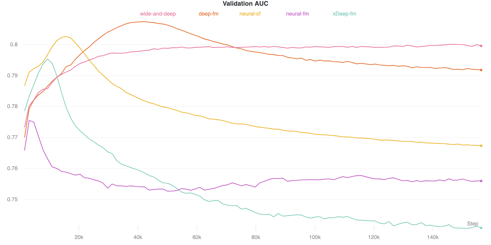

# Multilayer Perceptron for Collaborative Filtering

This is a series of Multilayer Perceptron models for Collaborative Filtering implemented in PyTorch.

Here are the 5 different models:

* [Wide and Deep Learning](https://github.com/khanhnamle1994/transfer-rec/tree/master/Multilayer-Perceptron-Experiments/Wide-and-Deep-PyTorch) ([paper](https://github.com/khanhnamle1994/transfer-rec/blob/master/Multilayer-Perceptron-Experiments/Wide-and-Deep-Learning-for-Recommendation-Systems.pdf))
* [Deep Factorization Machines](https://github.com/khanhnamle1994/transfer-rec/tree/master/Multilayer-Perceptron-Experiments/DeepFM-PyTorch) ([paper](https://github.com/khanhnamle1994/transfer-rec/blob/master/Multilayer-Perceptron-Experiments/DeepFM-A-Factorization-Machine-Based-Neural-Network-For-CTR-Prediction.pdf))
* [Extreme Deep Factorization Machines](https://github.com/khanhnamle1994/transfer-rec/tree/master/Multilayer-Perceptron-Experiments/xDeepFM-PyTorch) ([paper](https://github.com/khanhnamle1994/transfer-rec/blob/master/Multilayer-Perceptron-Experiments/xDeepFM-Combining-Explicit-and-Implicit-Feature-Interactions-For-Recommender-Systems.pdf))
* [Neural Factorization Machines](https://github.com/khanhnamle1994/transfer-rec/tree/master/Multilayer-Perceptron-Experiments/Neural-FM-PyTorch) ([paper](https://github.com/khanhnamle1994/transfer-rec/blob/master/Multilayer-Perceptron-Experiments/Neural-Factorization-Machines-For-Sparse-Predictive-Analytics.pdf))
* [Neural Collaborative Filtering](https://github.com/khanhnamle1994/transfer-rec/tree/master/Multilayer-Perceptron-Experiments/Neural-CF-PyTorch-Version2) ([paper](https://github.com/khanhnamle1994/transfer-rec/blob/master/Multilayer-Perceptron-Experiments/Neural-Collaborative-Filtering.pdf))


## Download and Process Data
You can download the MovieLens-1M dataset from [this folder](https://github.com/khanhnamle1994/transfer-rec/tree/master/ml-1m).

## Training Models

To run the Wide and Deep Learning model:

```
python Wide-and-Deep-PyTorch/main.py
```

To run the Deep Factorization Machines model:

```
python DeepFM-PyTorch/main.py
```

To run the Extreme Deep Factorization Machines model:

```
python xDeepFM-PyTorch/main.py
```

To run the Neural Factorization Machines model:

```
python Neural-FM-PyTorch/main.py
```

To run the Neural Collaborative Filtering model:

```
python Neural-CF-PyTorch-Version2/main.py
```

## Evaluating Results

Here are the results for all these models after 100 epochs of training:

|     Model     | Test AUC | Valid AUC |  Runtime |
|:-------------:|:--------:|:---------:|:--------:|
| wide-and-deep |  0.7991  |   0.7995  | 1h12m15s |
|    deep-fm    |  0.7915  |   0.7918  | 1h10m50s |
|    xDeep-fm   |  0.7429  |   0.7408  | 2h15m17s |
|   neural-fm   |  0.7589  |   0.7560  |  1h36m0s |
|   neural-cf   |  0.7668  |   0.7673  |  54m15s  |

* Wide and Deep model has the best test AUC and validation AUC
* Neural Collaborative Filtering has the lowest runtime

