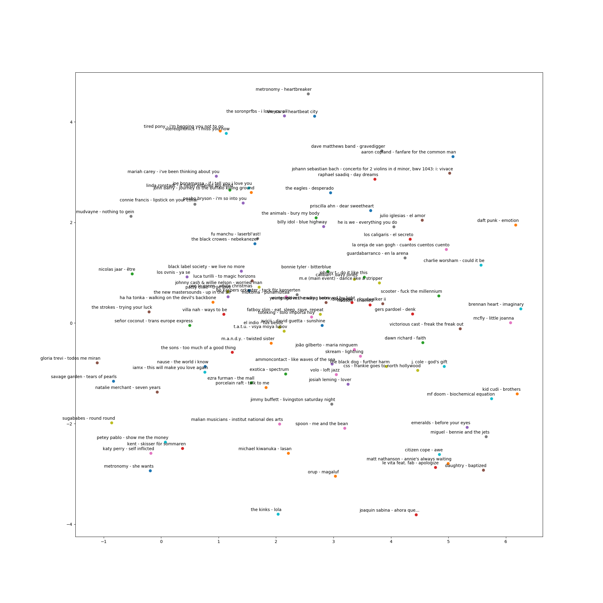

# word2vec Experiment

In this section, I built a word2vec-based music recommendation system, by translating user playlist into a word2vec embedding matrix.
This utilizes the context of a track or other tracks to map similar songs close to each other.
To learn more about the model and the implementation, you can check this [repository](https://github.com/SimoAntikainen/word2vec-music-recommendation).

## Requirements
```
Numpy
Pandas
Matplotlib
Sklearn
Gensim
```

## Spotify Playlists Dataset
This dataset is based on the subset of users in the #nowplaying dataset who publish their #nowplaying tweets via Spotify.
In principle, the dataset holds users, their playlists and the tracks contained in these playlists. 

The csv-file (not included in GitHub because of size) holding the dataset contains the following columns:  "user_id", "artistname", "trackname", "playlistname", where:
- **user_id** is a hash of the user's Spotify user name
- **artistname** is the name of the artist
- **trackname** is the title of the track and
- **playlistname** is the name of the playlist that contains this track.

The separator used is single comma, each entry is enclosed by double quotes, and the escape character used is slash (\).

A description of the generation of the dataset and the dataset itself can be found in the following [paper](https://evazangerle.at/publication/somera-15/somera-15.pdf]):
- Pichl, Martin; Zangerle, Eva; Specht, Günther: "*Towards a Context-Aware Music Recommendation Approach: What is Hidden in the Playlist Name?*" in 15th IEEE International Conference on Data Mining Workshops (ICDM 2015), pp. 1360-1365, IEEE, Atlantic City, 2015.

## Scripts
- [`data_prep.py`](data_prep.py): This is the data preparation script that pre-processes the playlist data.
- [`evaluate.py`](evaluate.py): This the evaluation script that evaluates the recommendation model based on Hit Ratio and Normalized Discounted Cumulative Gain (NDCG).
- [`train_word2vec.py`](train_word2vec.py): This is the training script that defines and trains the word2vec model, also returns evaluation metrics.
- [`recommend.py`](recommend.py): This is the recommendation script that shows a sample recommendation and visualizes the playlist embedding.



## Results
I got **Hit Ratio =  0.170679** and **NDCG = 0.059769** using the hyper-parameter setting below:
- Number of Epochs = 30
- Window Size = 5
- Sub-Sampling Parameter = 0.01
- Negative Sampling Distribution Parameter = 0.75
- Embedding Size = 50
- Negative Sample Size = 5
- Learning Rate = 0.025
- Minimum Count = 5

Once the training is done, you will find the model checkpoint `word2vec.model` saved into the `models` folder.
Select the model, rename it to `model.pth` and copy it in `../api/ml/checkpoints/` folder.
The API scripts will be in charge of the inference based on this model.